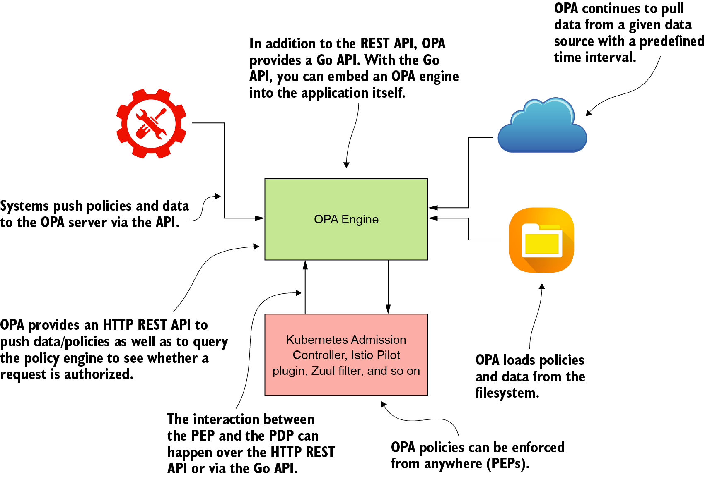
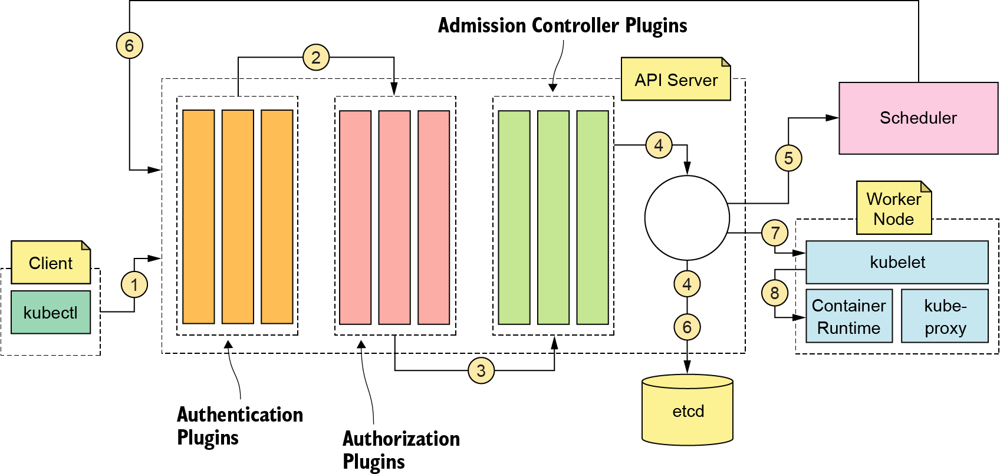
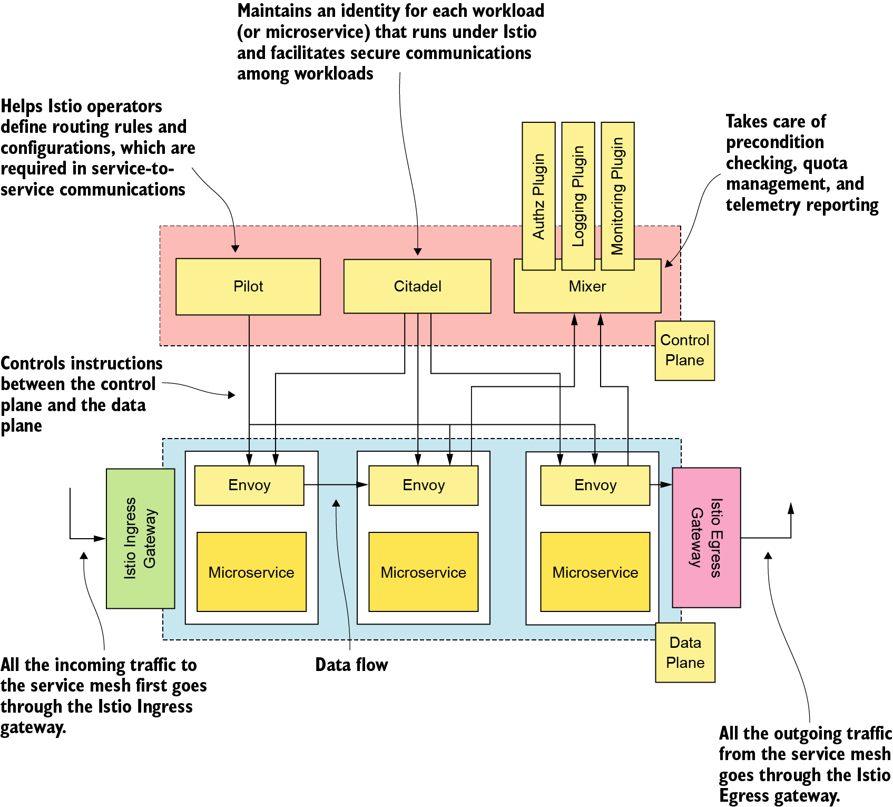

# **The Open Policy Agent** (_OPA-Gatekeeper_: Integration for Kubenetes Admission Controller)

## **Open Policy Agent (oh-pa), what is it?**
As stated by the designer “Styra”, the Open Policy Agent can be leveraged as a means in facilitating a unified toolset and framework for policy across the cloud native stack.

Primarily, OPA is an open source, lightweight, general-purpose policy engine that has no dependency on microservices. You can use OPA to define fine-grained access-control policies and enforce those policies at different locations throughout the infrastructure as well as within a microservices deployment.  Further, to define access-control policies, OPA introduces a new declarative language called Rego.

The OPA engine can run on its own as a standalone deployment or as an embedded library along with an application.  When you run the OPA server as a standalone deployment, it exposes a set of REST APIs that PEPs (Policy Enforcement Points) can connect to and check authorization.

# **OPA high-level architecture**

# **OPA Policies**
To define access-control policies, OPA introduces a new declarative language called Rego.  You can find more details about Rego at (http://www.openpolicyagent.org/docs/latest/policy-language/).

## OPA policy written in Rego – example1 ##
package authz.orders.policy1
  
default allow = false

allow {

  input.method = "POST"

  input.path = "orders"

  input.role = "manager"    
}

allow {
        
  input.method = "POST"

  input.path = ["orders",dept_id]

  input.deptid = dept_id

  input.role = "dept_manager"

}

The policy defined above has two allow rules. For an allow rule to return true, every statement within the allow block must return true. The first allow rule returns true only if a user with the manager role is the one doing an HTTP POST on the orders resource. The second allow rule returns true if a user with the dept_manager role is the one doing an HTTP POST on the orders resource under their own department.

## Rego input document with manager role – example1##
{
   "input"
   :{

     "path":"orders",

     "method":"POST",

     "role":"manager"

   }

}

## Rego input document with dept_manager role – example1##
{
   "input"
   :{

     "path":["orders",1000],

     "method":"POST",

     "deptid":1000,

     "role":"dept_manager"

   }

}

## Improved OPA policy written in Rego – example2 ##
package authz.orders.policy2

default allow = false

allow {

  allowed_methods_for_manager[input.method]

  input.path = "orders"

  input.role = "manager"

}

allow {

  allowed_methods_for_dept_manager[input.method]

  input.deptid = dept_id

  input.path = ["orders",dept_id]

  input.role = "dept_manager"

}
 
allow {

  input.method = "GET"

  input.empid = emp_id

  input.path = ["orders",emp_id]

}

allowed_methods_for_manager = {"POST","PUT","DELETE"}

allowed_methods_for_dept_manager = {"POST","PUT","DELETE"}

## Rego input document with manager role – example2 ##
{
   "input":{

     "path":"orders",

     "method":"PUT",

     "role":"manager"

   }

}

## Rego input document with dept_manager role – example2 ##
{
   "input":{

     "path":["orders",1000],

     "method":"POST",

     "deptid":1000,

     "role":"dept_manager"

   }

}

# OPA Integrations #
As a general-purpose policy engine, OPA can address a large variety of access-control use cases. For example, you can use OPA with Kubernetes and Docker for admission control, with Envoy, Kong, and other popular API gateways for API authorization, with Spinnaker, Boomerang, and Terraform in CI/CD pipelines and with SQLite for data filtering.

## Example Microservices Deployment Related Use Cases ##
### Kubernetes Admission Controller ###
The Kubernetes admission controller is a component that’s run in the Kubernetes API server.  When an API request arrives at the Kubernetes API server, it goes through a set of authentication and authorization plugins and then, finally, the admission controller plugins.  

_A request generated by kubectl passes through authentication, authorization, and admission controller plugins of the API server; is validated; and then is stored in etcd. The scheduler and kubelet respond to events generated by the API server._

**OPA Gatekeeper** is a native integration of OPA into the Kubernetes API server that lets you write policies that are enforced via admission control. It lets you control which Pods, Ingresses, Services, and so on, are allowed on the Kubernetes cluster and how they are individually configured. Common policies include ensuring that all images come from a trusted image registry, prohibiting multiple Ingresses from using the same host, and requiring encryption be used on storage.

### Istio ###
Istio is a service mesh implementation developed by Google, Lyft, and IBM. It’s open source and is currently the most popular service mesh implementation. 

Istio introduces a component called Mixer that runs on an Istio control plane. Mixer takes care of precondition checking, quota management, and telemetry reporting. For example, when a request hits the Envoy proxy at the data plane, it talks to the Mixer API to see if it’s OK to proceed with that request. Mixer has a rich plugin architecture, so you can chain multiple plugins in the precondition check phase. For example, you can have a mixer plugin that connects to an external PDP (Policy Decision Point) to evaluate a set of access-control policies against the incoming request.

_Istio high-level architecture with a control plane and a data plane_

Istio integrates with OPA in two ways: via the OPA Mixer adapter (plugin) and directly with Envoy’s check API. You pick one or the other; there is no need for both. For the Mixer integration, when a request hits the Envoy proxy in the data plane, it does a **check** API call to Mixer. This API call carries certain attributes with respect to the request (for example, path, headers, and so on). Then Mixer hands over control to the OPA mixer adapter. The OPA mixer adapter, which embeds the OPA engine as an embedded library, does the authorization check against defined policies and returns the decision to Mixer and then to the Envoy proxy.

For the second style of integration with Istio, OPA runs as a sidecar next to each instance of Envoy. Mixer is not involved at all. When a request hits the Envoy proxy, it asks OPA directly for an authorization decision, providing the same information it would provide to Mixer. OPA makes a decision, and Envoy enforces it. The benefit to this approach is that all decisions are made locally on the same server as the microservice and require no network hops, yielding better availability and performance.

### Apache Kafka ###
Apache Kafka is the most popular message broker implementation used in microservices deployments. To use OPA for Kafka authorization, you need to engage the **OPA Authorizer** plugin with Kafka. To authorize a request, the OPA Authorizer plugin talks to a remote OPA server over HTTP.  In a Kubernetes deployment, you would deploy the OPA server as a sidecar along with Kafka on the same Pod.

